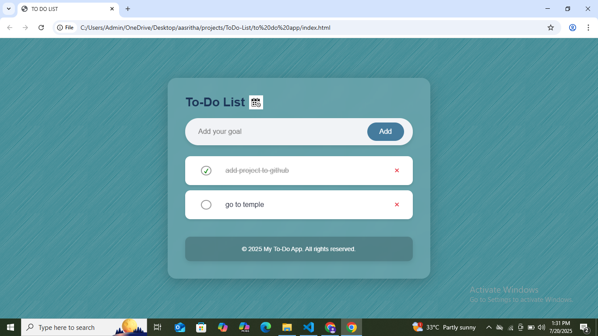

# 📝 To-Do List App

A simple and stylish To-Do List web application built with **HTML**, **CSS**, and **JavaScript**. This project allows users to add, complete, and delete tasks. It also stores the tasks in the browser using **LocalStorage**, so they persist even after refreshing the page.

## 🚀 Features

- ✅ Add new tasks
- ✏️ Mark tasks as completed
- ❌ Delete tasks
- 💾 Tasks are saved automatically using LocalStorage
- 📅 Dynamic footer with the current year

## 📸 Screenshot


 <!-- Replace with your own screenshot or link -->

## 🛠️ Technologies Used

- HTML5
- CSS3 (Modern UI Styling)
- JavaScript (DOM manipulation + LocalStorage)

## 📂 Folder Structure
ToDo-List/
├── index.html # Main HTML file

├── style.css # Custom styling

├── script.js # Core JavaScript logic

├── screenshot.png # UI screenshot

└── README.md # Project documentation

## 🔧 Setup Instructions
1. Clone the repository:
   ```bash
   git clone https://github.com/Aasritha-26/ToDo-List.git
2. Open index.html in any modern web browser.


